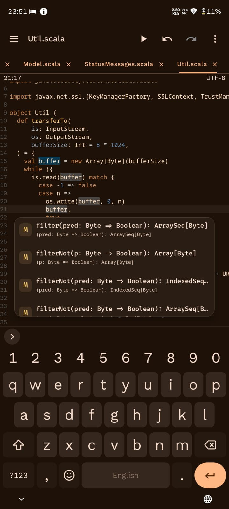
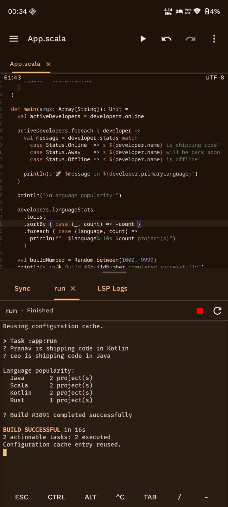
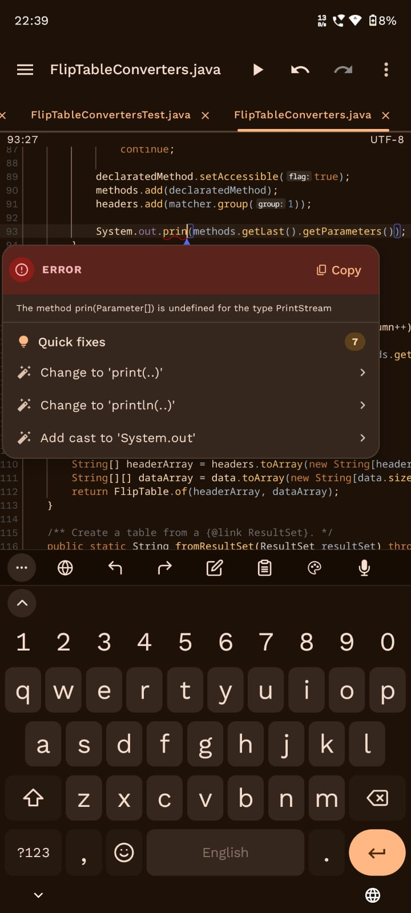
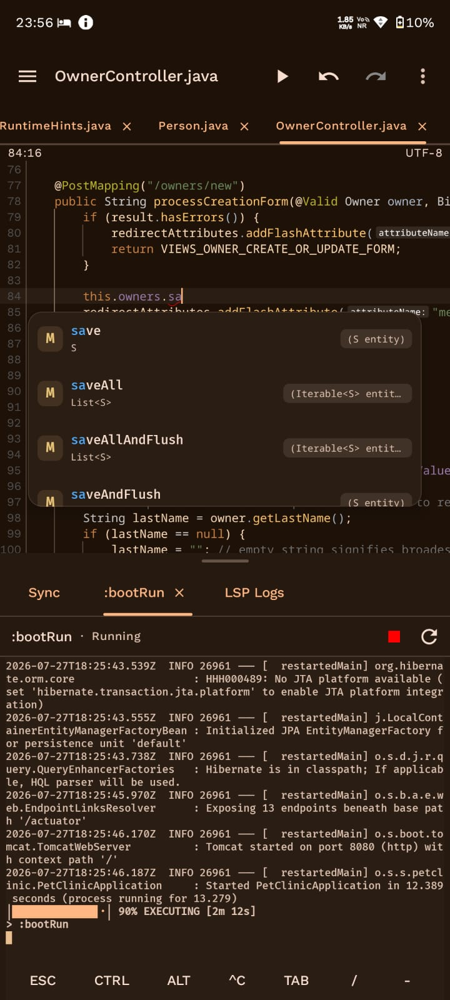
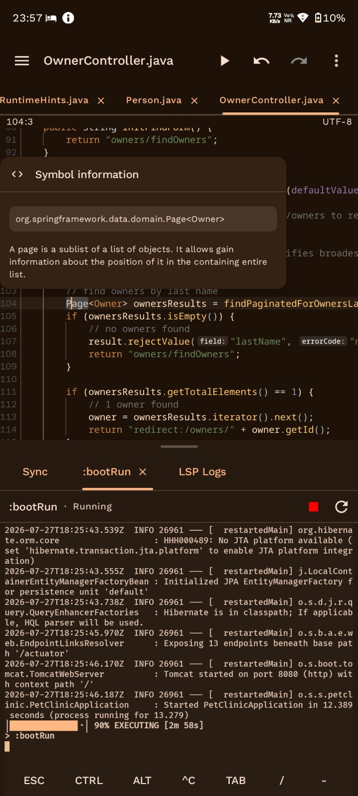
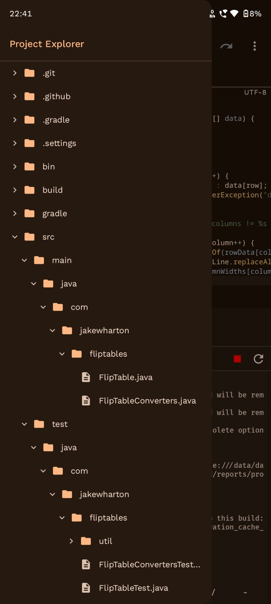
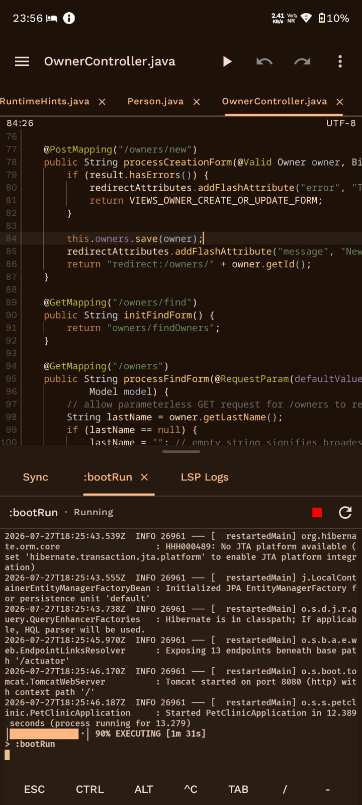

# Cosmic IDE

### Build real software directly on your Android device

A modern code editor, terminal, Gradle workspace, and development toolchains—all in one
Android app.

[Download](#download) · [Get started](#getting-started) · [User guide](docs/user-guide.md) ·
[Join the community](#community)

<table>
  <tr>
    <td align="center" width="50%">
      
       
      <strong>Metals-powered Scala completion</strong>
    </td>
    <td align="center" width="50%">
      
       
      <strong>Readable Gradle output and successful task execution</strong>
    </td>
  </tr>
  <tr>
    <td align="center" width="50%">
      
       
      <strong>Inline diagnostics and one-tap quick fixes</strong>
    </td>
    <td align="center" width="50%">
      
       
      <strong>Java completion backed by JDT LS while a Gradle application keeps running</strong>
    </td>
  </tr>
  <tr>
    <td align="center" width="50%">
      
       
      <strong>Types and documentation without leaving your code</strong>
    </td>
    <td align="center" width="50%">
      
       
      <strong>A touch-friendly project tree for real repositories</strong>
    </td>
  </tr>
  <tr>
    <td align="center" width="50%">
      
       
      <strong>Edit while Spring Boot runs in an integrated task tab</strong>
    </td>
  </tr>
</table>

## Your development workspace, in your pocket

Cosmic IDE lets you create, edit, build, run, and manage projects without relying on a desktop
computer. It is designed for learning, experimenting, fixing code on the go, and working on serious
projects from a phone, tablet, or Android desktop setup.

| Write comfortably                                                                                     | Build and run                                                  | Stay in control                                                                |
|-------------------------------------------------------------------------------------------------------|----------------------------------------------------------------|--------------------------------------------------------------------------------|
| Syntax highlighting, completion, diagnostics, navigation, customizable fonts, and Material You themes | Integrated Gradle tasks, project commands, and a full terminal | Local project files, Git workflows, ZIP import and backup, and selectable JDKs |

## What you can do

- Create ready-to-use Java, Kotlin, or Scala Gradle projects.
- Open and edit projects with tabs, a file explorer, autosave, and rich code intelligence.
- See errors, completions, hover information, signatures, references, and navigation from supported
  language servers.
- Install packages directly from the Arch Linux ARM repositories through pacman, giving you access to a broad ecosystem of development tools and utilities inside Cosmic IDE.
- Build, test, run, and inspect Gradle output without leaving the editor.
- Clone repositories and use common Git actions such as pull, push, commit, branch, and checkout.
- Work in an interactive Linux terminal with familiar command-line tools.
- Import a project from ZIP and export backups through Android's document picker.
- Personalize font, font size, indentation, word wrap, ligatures, line numbers, whitespace markers,
  sticky scroll, and other editor behavior.
- Add custom language servers, TextMate grammars, project types, commands, and plugins.

## Language support

Cosmic IDE provides a guided first-party setup for:

| Language          | Code intelligence           |
|-------------------|-----------------------------|
| Java              | Eclipse JDT Language Server |
| Kotlin            | Official Kotlin LSP         |
| Scala             | Metals                      |
| Gradle and Groovy | Gradle Language Server      |

Other languages can be added with a compatible language server and TextMate grammar. Rust, C++,
XML, and similar workflows can be configured when their Linux/arm64 tools support Android's app
environment.

## Download

Download the latest successful `main` build from
[nightly.link](https://nightly.link/Cosmic-Ide/Cosmic-IDE/workflows/android/main/app-arm64-v8a.zip).

> [!NOTE]
> The current development version targets Android 8 or newer and is intended for arm64 devices.

## Getting started

1. Install Cosmic IDE and open it.
2. Choose and install a JDK when prompted.
3. Complete the guided development-tool setup.
4. Create a project, import a ZIP, or clone a Git repository.

The first setup downloads a Linux runtime, JDK, and selected development tools. Use a stable
connection, keep the app open, and make sure the device has enough free storage. After setup, the
Projects screen becomes the starting point for your work.

For a walkthrough of projects, the editor, builds, Git, terminal sessions, and settings, see the
[user guide](docs/user-guide.md).

## Designed for Android

- Material You interface with light and dark themes
- Touch-friendly project explorer and editor controls
- Android document picker integration for imports, backups, grammars, and custom fonts
- An Arch Linux ARM userspace with broad `pacman` support and access to its aarch64 repositories
- App-private Linux environment—no root access required
- Phone, tablet, keyboard, and Android desktop workflows
- Local projects that remain under your control

Most packages from the Arch Linux ARM repositories can be installed directly with `pacman`.
Packages that require unavailable kernel features, privileged operations, or unsupported hardware
may still be limited by Android's application sandbox.

<strong>Advanced language and tool support</strong>

Cosmic IDE can start standard-input/output language servers inside its app-private Linux
environment. A custom server can be associated with a file extension and an optional TextMate
grammar from an HTTPS link, Android document, or local file.

The same environment is available to the terminal, compilers, build tools, Gradle, and custom
project commands. Compatibility depends on whether the required binaries support Linux/arm64 and
can run within Android's application sandbox.

Custom startup commands execute with the app's permissions. Only use commands and project build
scripts you trust.

[Read the language-service guide](docs/editor-and-language-services.md) ·
[Read about data and permissions](docs/data-permissions-and-security.md)

## Frequently asked questions

### Does Cosmic IDE require root?

No. Its development tools run inside the app's private environment using normal Android
permissions.

### Can I use it offline?

Editing and already-installed tools can work offline. Initial setup, dependency downloads, Git
network operations, and some builds still require an internet connection.

### Is it only for JVM projects?

No. Java, Kotlin, and Scala have the most guided experience, but custom language servers, commands,
and project types can support other toolchains.

### Can it replace a desktop IDE?

That depends on the project and device. Cosmic IDE offers a complete mobile workflow, but large
builds and language servers are still limited by the memory, storage, battery, and permissions of
an Android application.

### Where can I get help?

Start with the [user guide](docs/user-guide.md) and
[troubleshooting section](docs/user-guide.md#troubleshooting), then ask in the community or open a
GitHub issue.

## Documentation

### For users

- [User guide](docs/user-guide.md)
- [Settings reference](docs/settings-reference.md)
- [Data, permissions, and privacy](docs/data-permissions-and-security.md)

### For contributors

- [Building and contributing](docs/development-guide.md)
- [Codebase architecture](docs/codebase-architecture.md)
- [Plugin architecture](docs/plugin-architecture.md)
- [Complete documentation index](docs/README.md)

## Community

- [Discord](https://discord.gg/46wCMRVAre)
- [Telegram](https://t.me/cosmicide)
- [GitHub Issues](https://github.com/Cosmic-Ide/Cosmic-IDE/issues)
- [Email](mailto:purwarpranav80@gmail.com)

Friendly bug reports, feature ideas, documentation improvements, and code contributions are
welcome. Developers can begin with the [contribution guide](docs/development-guide.md).

## Help sustain Cosmic IDE

Cosmic IDE is free, open source, and built without ads or paid feature gates. Support helps with:

- Maintaining the Arch Linux ARM runtime and broad `pacman` compatibility
- Adapting language servers, JDKs, Gradle, and other development tools for Android
- Tracking Android platform changes and testing across different devices

  

Financial support is optional. Useful bug reports, documentation improvements, and code
contributions are equally valuable.

Other donation methods

- **Bitcoin:** `bc1q3eesyfn7lhql4c2khv56cyvw2374zkhe7r97hz`
- **Ethereum:** `0xD80A8D6E0fa433A8bDFC2D3F325159Db70605816`
- **Monero:**
  `848dAWBVk8GMaoRHg6HUP5CbkpY9pJra1KNQAo9yJ6vbJLFsjFD8ZHkGpi6FhVY7rsD4U9iR7brk64eknsC3bS7tV9JRU4f`
- **Solana:** `7FxTAJLmhXFp6wxVbUTpf8jDmzEX1CKVMdE8oLPNQvyb`
- **Litecoin:** `ltc1q3pqyj5ge5rdmqr00w03x4tlhm6rhcc6wrfyx8k`
- **UPI:** `pranavpurwar@fam`

## Acknowledgments

Cosmic IDE builds on open-source projects including
[Sora Editor](https://github.com/Rosemoe/sora-editor),
[Termux](https://github.com/termux/termux-app), and the
[Gradle Tooling API](https://docs.gradle.org/current/userguide/tooling_api.html). Thank you to
[Iyxan23](https://github.com/Iyxan23) for the application icon and to every contributor who has
helped improve the project.

## License

Cosmic IDE is free and open-source software licensed under the
[GNU General Public License v3.0](LICENSE).
